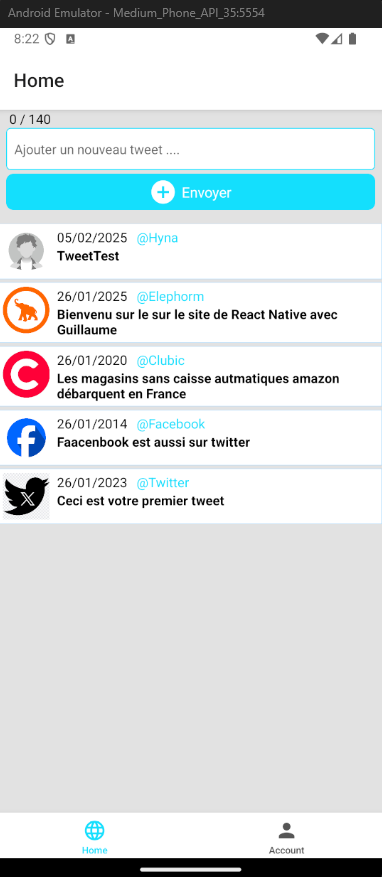

# Tweetly - Learning React Native 🚀

Welcome to **Tweetly**, a beginner-friendly **React Native** app built using **Expo**! 🎉 This project was created as part of an introductory course on **React Native**, covering fundamental concepts like:

- Setting up a React Native project with **Expo** 📱
- Navigating with **React Navigation** 🧭
- Managing state with **useState** and **useEffect** ⚡
- Storing and retrieving data using **AsyncStorage** 💾
- Handling dynamic lists and unique keys 🗂️

## 📸 App Preview


## 🚀 Getting Started

### 1️⃣ Install dependencies
```bash
npm install
```

### 2️⃣ Start the app
```bash
npx expo start
```

You'll have the option to open the app in:
- A [development build](https://docs.expo.dev/develop/development-builds/introduction/)
- An [Android emulator](https://docs.expo.dev/workflow/android-studio-emulator/)
- An [iOS simulator](https://docs.expo.dev/workflow/ios-simulator/)
- [Expo Go](https://expo.dev/go) for quick testing

## 🎯 Features Implemented
✅ **List of Tweets** (Static & Persistent with AsyncStorage)
✅ **Add new Tweets** dynamically
✅ **Delete all Tweets** (Clear AsyncStorage)
✅ **React Navigation** (Tabs & Stack Navigation)
✅ **Custom Components** (TweetBox, TweetList)

## 🔄 Reset the Project
If you want a fresh start, run:
```bash
npm run reset-project
```
This will move the starter code to the **app-example** directory and create a blank **app** directory.

## 📚 Learn More
Here are some useful resources to deepen your React Native knowledge:
- 📖 [React Native Docs](https://reactnative.dev/docs/getting-started)
- 📚 [Expo Documentation](https://docs.expo.dev/)
- 🏗️ [React Navigation](https://reactnavigation.org/docs/getting-started)
- 🎓 [Learn React Native](https://reactnative.dev/docs/tutorial)

## 💬 Join the Community
- 🔗 [Expo GitHub](https://github.com/expo/expo)
- 💬 [Discord Community](https://chat.expo.dev)

Happy coding! 🎉🔥

